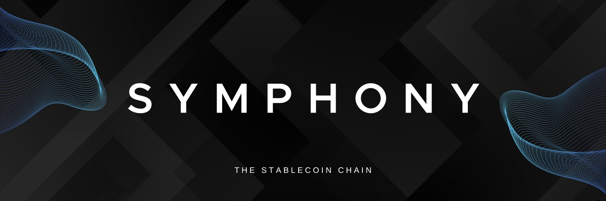

# Symphony 



## Overview
Symphony is a chain built on Cosmos that provides a crypto-native solution for real-world assets not reliant on traditional banking infrastructure. It can peg to any asset, allowing global access to trade across mediums such as real-estate and gold, as well as easily accessed infrastructure to build market systems such as ForEx.

## Hardware Requirements
* CPU : 4x CPUs
* Ram : 8GB RAM 
* Storage: 100GB of storage (SSD or NVME)

## Public Endpoint
* RPC
```
https://rpc-symphony.jhonswg.com 
```
* API 
```
https://api-symphony.jhonswg.com
```