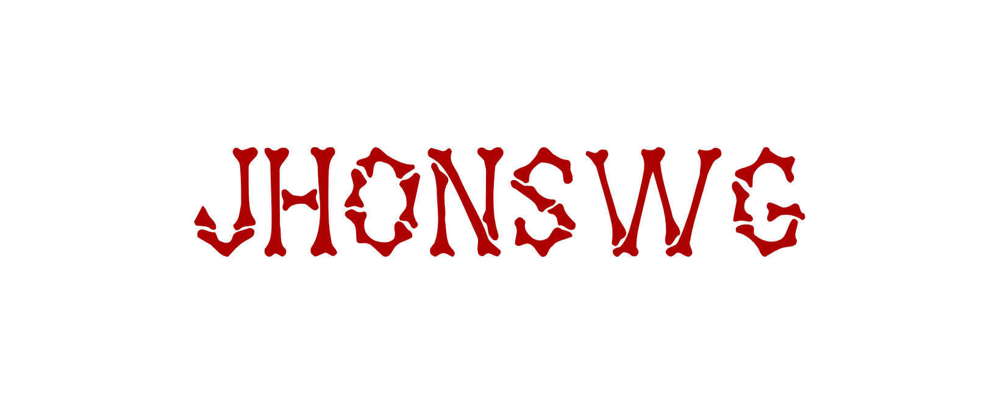

---

title: Introduction

description: This is the official documentation for Chainflip, a cross-chain decentralised exchange, based on a proof-of-stake validator network, that uses highly efficient threshold signing schemes and a unique AMM design to offer users a maximally efficient and low friction method to trade digital assets in a totally decentralised system.

---

# Introduction 

 

* Website    : Https://jhonswg.com 
* Telegram   : https://t.me/jhonswg
* Discord    : https://discord.com/users/847151330807382067
* X          : https://twitter.com/jhonswgeth